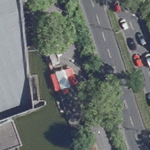

# single-image-ESRGAN
Enhance low-res images with enhanced super-resolution ESRGAN (Keras / Tensorflow implementation).

 

The overall structure is based on this SRGAN implementation: https://github.com/zushicat/single-image-SRGAN    

Please check out the according README for details on usage and the mechanics, since those basically apply here as well. 
Also, I try to avoid unnecessary redundancy and rather like to point out how the implementations differ from each other.    


## Differences between the implementations of mentioned SRGAN and this ESRGAN
### data_loader.py
- Pass the percentage of the training set you like to compute with *percent_of_training_set* when initializing the DataLoader class (in \__init\__ of Pretrainer and Trainer)    
The default is 0.5 (50%)
- in function *load_images*:    
I additionally use "pre-crops" of resized versions of the images (i.e. 1600x1600 pixel -> 800x800 pixel and 400x400 pixel, applied to 96x96 pixel -> 24x24 pixel crops) which seems to improve the quality of generated images with input of images with overall lower quality (see below: Results)    
I admittedly didn't really *measure* the results, so it's up to you: If you consider this as utter useless, change following loop accordingly (i.e. remove):
```
for size in [None, original_img.height//2, original_img.height//4]
````

### esrgan.py
Check out this YT video for a great overview about the differences between SRGAN and ESRGAN:     
["How Super Resolution Works" by Leo Isikdogan](https://www.youtube.com/watch?v=KULkSwLk62I)    

Also, have a look at this blogpost with implementation examples:     
["ESRGAN: Enhanced Super-Resolution Generative Adversarial Network using Keras" by Chhaya Vankhede](https://medium.com/analytics-vidhya/esrgan-enhanced-super-resolution-generative-adversarial-network-using-keras-a34134b72b77)    

In fact, there are not too many things that changed.    

**class ESRGAN**    
Modified network architecture of the generator: 
- no batch normalization (which can also cause dreaded artifacts)
- additionally in function *upsample*
    - use SubpixelConv2D function (instead of UpSampling2D)
- more layers and connections (see: functions *RRDB* and *dense_block*)    

**class Trainer**    
Changed loss functions (called in function *train_step*)
- using a relativistic discriminator, trying to predict the probability if a real image is relatively more realistic than a fake image

### inference.py
No differences.


## Results
- Output images 1: model trained on 96x96 pixel crops taken from original high res 1600x1600 pixel images (fixed size)
- Output images 2: model trained on 96x96 pixel crops taken from images original high res images and additionally resized versions (800x800 pixel, 400x400 pixel)

Both models were trained with
  - Pretrain: 400000 steps
  - Finetune: 1000000 steps

You can find the trained models of aerial images in:
- /model/image_generator_model.h5 (crops of variable input size of crops)
- /model/image_generator_model_fix_size.h5 (crops of 1600x1600 pixel image input size, only)

Both examples:    
These are 1/4 image crops of both input (resolution as stated) and output (input 4x upscale and resolution resized to 600x600 pixel)

**1 - Aerial images from 2019 taken with high resolution cameras.**

Resolution of input image  | Input images | Output images 1 |  Output images 2 
:-------------------------:|:-------------------------:|:-------------------------:|:-------------------------:
400x400 pixel |||
300x300 pixel |||
200x200 pixel |||
150x150 pixel |||
100x100 pixel |||


**2 - Aerial images from 2013 with lower image quality.**

Resolution of input image  | Input images | Output images 1 |  Output images 2 
:-------------------------:|:-------------------------:|:-------------------------:|:-------------------------:
400x400 pixel |||
300x300 pixel |||
200x200 pixel |||
150x150 pixel |||
100x100 pixel |||
